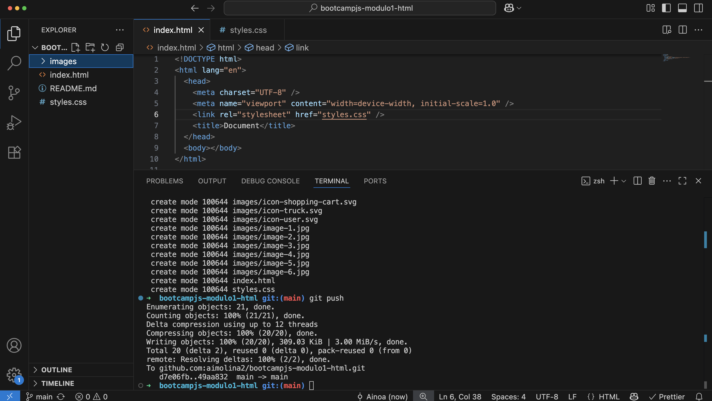
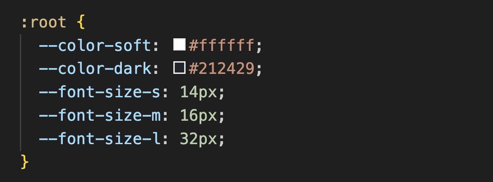
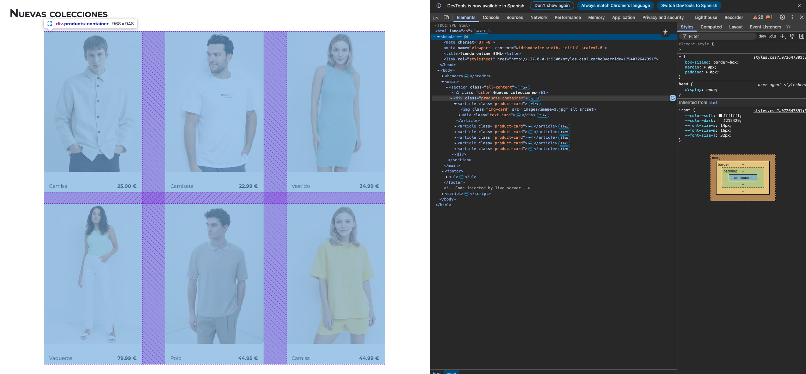
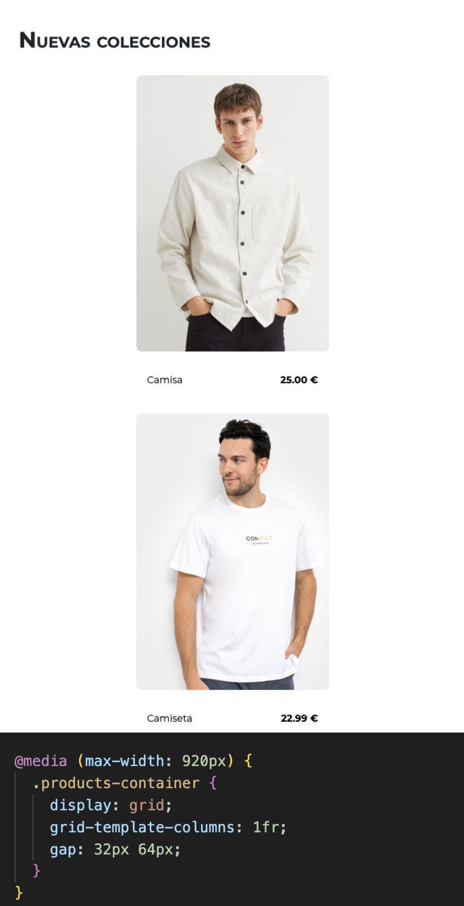
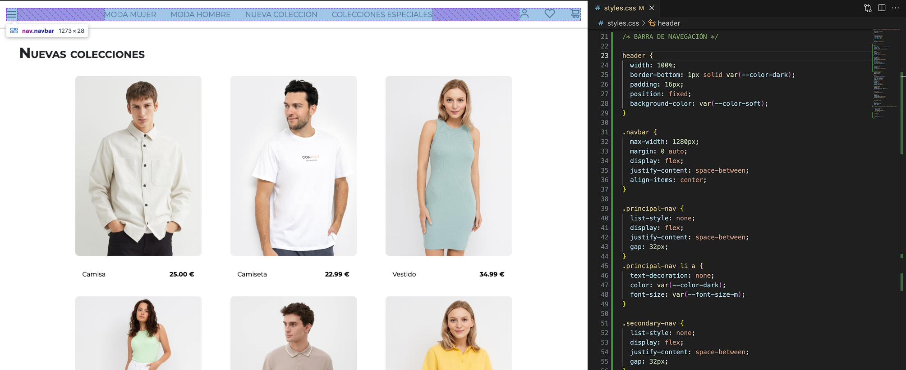
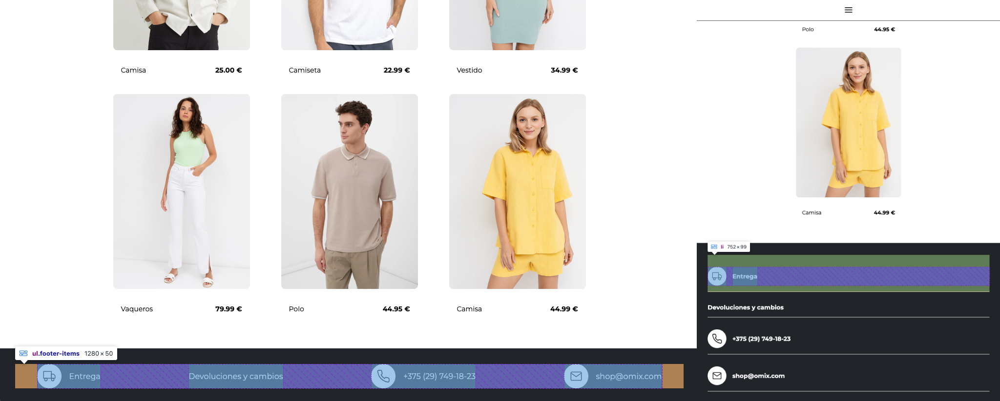
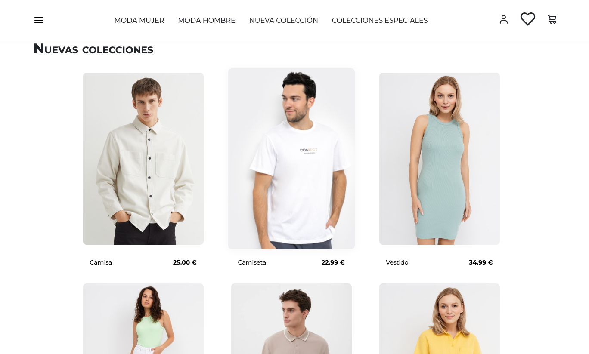

# Módulo 1. HTML.

A continuación se detalla el paso a paso del ejercicio de maquetación de la página web de una tienda online.

## 1. Crear un repositorio y puesta a punto para comenzar el proyecto

Creamos el repositorio en GitHub y lo iniciamos en local.

Abrimos la carpeta en Visual Studio Code y agregamos los archivos necesarios para iniciar la práctica.

1. Creación de una carpeta **images** donde guardamos los iconos e imágenes que usaremos en el proyecto
2. Creamos el archivo **index.html** y enlazamos la hoja de estilos CSS.
3. Creamos el archivo **styles-css** que iniciamos eliminando los paddings y márgenes por defecto que aplica la hoja de estilos, así como llamando a la fuente que usaremos mediante un @import.

Con todo esto listo hacemos un primer commit y subimos los cambios a GitHub con **git add .** / **git commit -m “mensaje”** / **git push**

## 2. Estructura de nuestro HTML (papel)

Con el diseño de la página a maquetar hacemos un boceto de cómo vamos a estructurar nuestro código, definiendo las etiquetas principales y contenedores.

## 3. Esquema de nuestro HTML

Empezamos a montar la estructura del proyecto en el HTML creando los contenedores y etiquetas principales. Incluimos todo el contenido al que daremos estilo desde la hoja de estilos CSS.

## 4. Maquetación del contenido principal - cards de producto

En primer lugar definimos el ancho total del contenedor: 1280 px.

Antes de empezar a aplicar estilos definimos algunas de las variables que vamos a usar de forma recurrente como los colores o tamaños de fuente.

Maquetamos el apartado principal de **NUEVAS COLECCIONES**. Damos estilo al **h1** y trabajamos las cards que componen la grid que ocupa gran parte de la sección.

Primero usamos _flex_ para alinear en columna el título y el contenedor de todas las cards. Dentro organizamos las cards de producto con _grid_. Los valores de disposición de la grid son los que cambiamos a la hora de definir la media query (que hemos establecido como **(max-width: 920px)**), pasando de ocupar **repeat(3, 1fr)** a una única fracción **1fr**.

## 5. Maquetación barra de navegación

La barra de navegación ocupa toda la pantalla y se mantiene fija al hacer scroll. Usamos **flexbox** para la organización de los ítems del menú.

En la declaración **@media (max-width: 920px)** donde habíamos indicado los cambios para cuando la resolución de la pantalla sea inferior a 920px añadimos las modificaciones para la barra de navegación: eliminamos los _ul_ y centramos la imagen del menú hamburguesa.

## 6. Maquetación footer

De forma similar a como hemos maquetado la barra de navegación damos estilo al footer, usando _flexbox_ para organizar los elementos (estos elementos están incluidos como un listado mediante la etiqueta **li**).

Después indicamos cómo funcionaría la maquetación cuando la pantalla es de 920px o menos, tal como hemos hecho con la barra de navegación.

## 7. Efectos y pequeñas interacciones

Agregamos efectos de _hover_ que ayudan al usuario a identificar elementos clickables y dar más dinamismo a la página.

- La barra del menú de navegación se amplia.
- Los ítems principales cambian su _font-weight_ a _bold_.
- Los iconos de la barra de navegación escalan aumentando su tamaño.
- Las imágenes de los productos aumentan y se genera un ligero sombreado (**box-shadow**).

Todos estos cambios tienen indicaciones de velocidad y "modo de entrada" para hacer que los cambios entren de una forma más suave y "natural". Usamos la propiedad **transition**.

## 8. Corrección de pequeños detalles

Por último, tras revisar el código y funcionamiento de la página ajustamos algunos padding y agregamos la propiedad **z-index:1** al header (al incluir las acciones de **:hover** observé que las cards se superponían a la barra de navegación, por lo que tuve que indicar que ésta tenía una posición superior).
